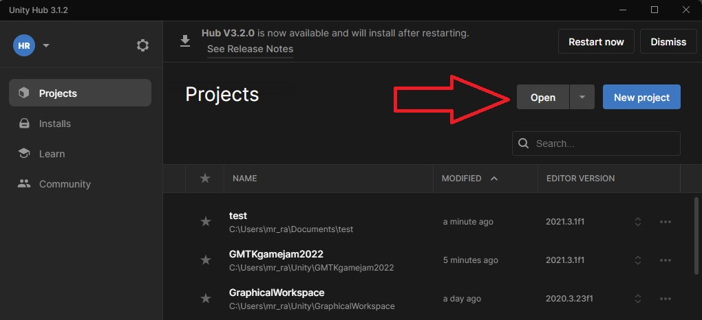
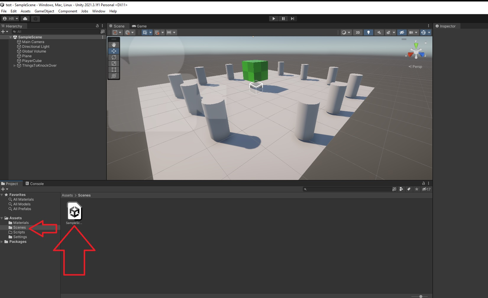

# GC TechSpace entry for the GMTK Game Jam

current participants

## Work Allocation
* Heath - Engine
* Jerome - Graphics
* David - Logos,Paperwork, itch.io submit requirements, splash page
* Skip - TBA

Readme status: Incomplete  
## When:  Saturday July 16th, 02:30AM to Monday July 18th, 02:30AM -48 hours -
### NOTE* We will be starting at a reasonable time on Saturday morning and finishing late Sunday.  Team members are welcome to come and go over the weekend.

## Where: 
GC TechSpace quite-room, workshop and remote (Slack/Discord).

## Info:
The [GMTK Game Jam](https://itch.io/jam/gmtk-jam-2022) is an annual game making marathon, where individuals and teams try to make a game that fits a theme, in just 48 hours.
*The theme will be announced at the start of the jam.*

We will be using Unity game engine to build our game. A basic build is attached in this repo.
Submissions are required to run in the browser or on Windows and be less then 1GB when submitted to itch.io

## FAQs

Q: I've never have created a game, what skills I can bring?

A: Building a game requires creativity and many disciplines.  Any knowledge of design, art, coding, math, music, sound design, etc will be useful. 

Q: I don't have time to be at a 48 hour game jam.

A: That is not a question. You can come and go as you please. Any level of contribution is welcome.

Q: What do I need to bring?

A: Nothing....but a laptop would be good. 

## Framework links and downloads: 
Use Unity version 2021.3.1f1 - same as boilerplate
[Unity account signup **free**](https://store.unity.com/front-page?check_logged_in=1#plans-individual)
[Unity LTS 2021.3.1f1 Windows](https://download.unity3d.com/download_unity/3b70a0754835/UnityDownloadAssistant-2021.3.1f1.exe)
[Unity LTS 2021.3.1f1 Mac](https://download.unity3d.com/download_unity/3b70a0754835/UnityDownloadAssistant-2021.3.1f1.dmg)
*Linux is a possibility but I have not tried it 

Highly recommend using Visual Studio 2022 as it has great support for Unity code development in C# [Quickstart: Configure Visual Studio for cross-platform development with Unity](https://docs.microsoft.com/en-us/visualstudio/gamedev/unity/get-started/getting-started-with-visual-studio-tools-for-unity?pivots=windows)

## Getting started

Clone this repo and add the root folder to Unity Hub.

It will take a while to open the first time as it will collect the packages and build files the project needs that are not included in the repo.
Once open, the scene may be called "Untitled" and empty. Navigate to "SampleScene" where I have made a simple scene. Explore here, experiment, break it. 
Use the play arrow at the top the start the game and again to stop it. 

